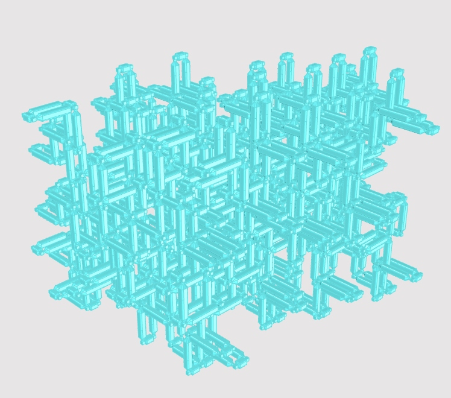

# Reclaimed Design Systems

Design systems developed during the AAVS26 Reclaim Seoul Workshop.

This repository collects reusable aggregation/design systems for material reuse workflows. Each system is stored as a folder inside `systems/`, with its own metadata, aggregation data, thumbnail, and generated documentation.

## Available systems

<!-- CATALOG:START -->
<!-- This section is automatically generated. Do not edit manually. -->

<table width="100%">
<colgroup>
<col width="50%">
<col width="50%">
</colgroup>
<tr>
<td width="50%" valign="top"><br><a href="systems/bottles-system/">Multi-Bottle System</a><br><br>A system for reusing bottles with different sizes<br><br>by Andrea Rossi<br><a href="systems/bottles-system/aggregation.json">aggregation.json</a> &middot; <a href="systems/bottles-system/meta.json">meta.json</a></td>
<td width="50%" valign="top"><br><a href="systems/melted-plastic/">melted plastic</a><br><br>A system for reusing bottles with different sizes<br><br>by SEUNGCHAN BAEK, JIHYEON BAEK<br><a href="systems/melted-plastic/aggregation.json">aggregation.json</a> &middot; <a href="systems/melted-plastic/meta.json">meta.json</a></td>
</tr>
<tr>
<td width="50%" valign="top"><br><a href="systems/plasticbottles/">plastic bottles with multi joint</a><br><br>A system for reusing bottles with different sizes<br><br>by Seunghyuk Hyun, Jahan<br><a href="systems/plasticbottles/aggregation.json">aggregation.json</a> &middot; <a href="systems/plasticbottles/meta.json">meta.json</a></td>
<td width="50%" valign="top"><br><a href="systems/plasticchain/">plastic bottles chain</a><br><br>A system for reusing bottles with different sizes<br><br>by Seunghyuk Hyun, Jahan<br><a href="systems/plasticchain/aggregation.json">aggregation.json</a> &middot; <a href="systems/plasticchain/meta.json">meta.json</a></td>
</tr>
<tr>
<td width="50%" valign="top"><br><a href="systems/test-system/">Test system</a><br><br>A system for reusing bottles with different sizes<br><br>by Andrea Rossi<br><a href="systems/test-system/aggregation.json">aggregation.json</a> &middot; <a href="systems/test-system/meta.json">meta.json</a></td>
<td width="50%" valign="top"><br><a href="systems/tree-angle/">tree-angle</a><br><br>A system for reusing wood with different sizes<br><br>by tree-team<br><a href="systems/tree-angle/aggregation.json">aggregation.json</a> &middot; <a href="systems/tree-angle/meta.json">meta.json</a></td>
</tr>
<tr>
<td width="50%" valign="top"><br><a href="systems/useatlas/">test123</a><br><br>A system for reusing bottles with different sizes<br><br>by jihyeon<br><a href="systems/useatlas/aggregation.json">aggregation.json</a> &middot; <a href="systems/useatlas/meta.json">meta.json</a></td>
<td width="50%" valign="top">&nbsp;</td>
</tr>
</table>

<!-- CATALOG:END -->

## Repository structure

```txt
systems/
  <system-slug>/
    aggregation.json
    meta.json
    00_thumb.png
    README.md

catalog/
  catalog.json

scripts/
  build_catalog.mjs
